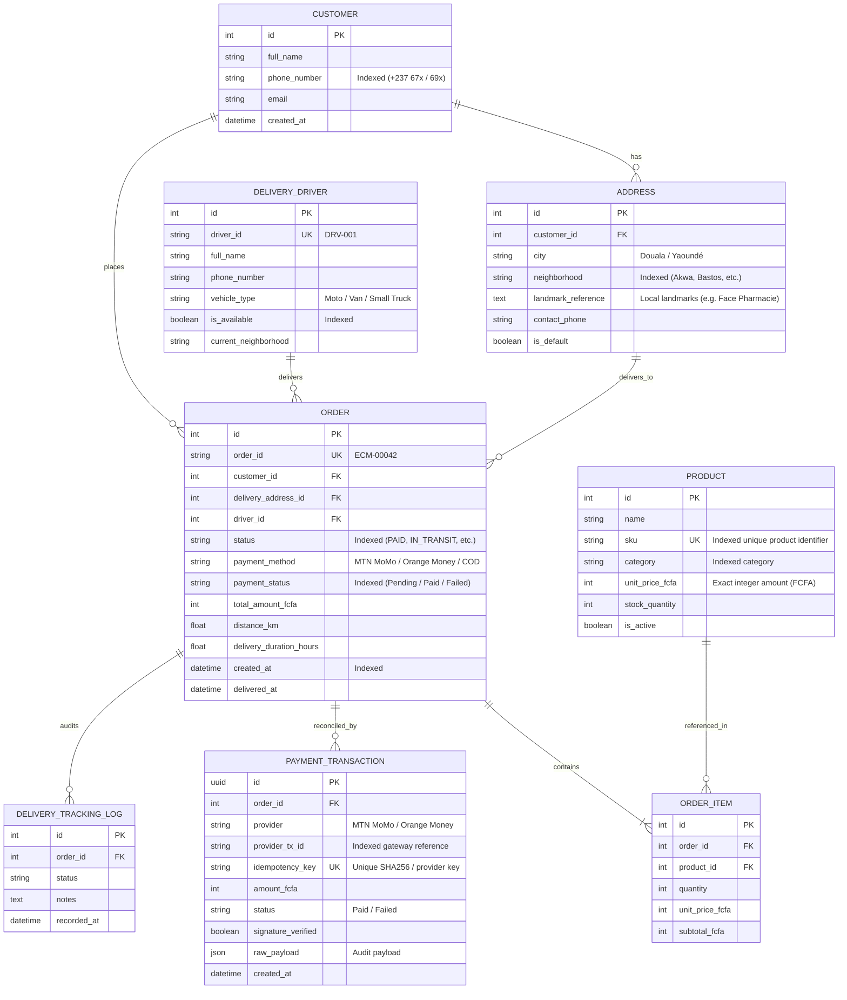

# 🇨🇲 AntCode Hub 48-Hour Sprint: E-Commerce Logistics & Payment Engine
> **Scenario B – Track 2: Backend / Fullstack Engineering**  
> **Candidate:** Hakimi Yvon ([@hakimi-yvon](https://github.com/hakimi-yvon))  
> **Target Problem:** Resolving the Cameroonian urban e-commerce logistics bottleneck, payment reconciliation (MTN MoMo & Orange Money), and high-concurrency peak load stability.

---

## 📑 Table of Contents
1. [System Architecture](#1-system-architecture)
2. [Database Relational Schema (ERD)](#2-database-relational-schema-erd)
3. [The AI Prompt Ledger (Compulsory Integrity Log)](#3-the-ai-prompt-ledger-compulsory-integrity-log)
4. [Cameroonian Context Adaptation](#4-cameroonian-context-adaptation)
5. [Database Indexing & Query Optimization Report](#5-database-indexing--query-optimization-report)
6. [Mobile Money Webhook Security & Idempotency](#6-mobile-money-webhook-security--idempotency)
7. [Installation & Quickstart](#7-installation--quickstart)
8. [Automated Test Suite](#8-automated-test-suite)
9. [3-Minute Video Pitch Script](#9-3-minute-video-pitch-script)

---

## 1. System Architecture

The system is architected as an asynchronous, decoupled backend platform designed to operate under the harsh realities of urban telecom networks in Douala and Yaoundé:

```mermaid
graph TD
    subgraph Clients & Third Parties
        D[📱 Driver Mobile Client]
        C[🛒 Customer Web / Mobile App]
        MOMO[🟡 MTN MoMo Gateway]
        OM[🟠 Orange Money Gateway]
    end

    subgraph API & Application Layer (Django + DRF)
        GW[🌐 Django REST Gateway]
        AUTH[🔒 HMAC Signature & Secret Verifier]
        IDEMP[🛡️ Idempotency Engine]
        VIEW_ORDER[📦 Order ViewSet & Dispatcher]
        VIEW_DRIVER[🛵 Driver Offline-Ready Feed]
        VIEW_METRICS[📊 Real-Time Bottleneck Metrics]
    end

    subgraph Persistence Layer (PostgreSQL / SQLite)
        DB[(🗄️ Relational Database)]
        IDX1[⚡ idx_order_driver_status]
        IDX2[⚡ idx_order_status_created]
        IDX3[⚡ idx_order_pay_status_created]
        IDX4[⚡ UNIQUE idempotency_key]
    end

    D -->|Polls assigned orders by neighborhood| VIEW_DRIVER
    D -->|Updates delivery status offline/online| VIEW_ORDER
    C -->|Places order| VIEW_ORDER
    MOMO -->|Callback Webhook POST| AUTH
    OM -->|Callback Webhook POST| AUTH

    AUTH --> IDEMP
    IDEMP -->|Atomic Lock: SELECT FOR UPDATE| DB
    VIEW_ORDER --> DB
    VIEW_DRIVER --> DB
    VIEW_METRICS --> DB

    DB --- IDX1
    DB --- IDX2
    DB --- IDX3
    DB --- IDX4
```

---

## 2. Database Relational Schema (ERD)



---

## 3. The AI Prompt Ledger (Compulsory Integrity Log)

*In accordance with Section 4 of the AntCode Hub Engineering Sprint, this ledger details the exact prompts, tools, engineering rationale, and critical manual corrections made.*

| # | Tool Used | Prompt Given | Rationale (What & Why) | Engineering Correction / AI Shortcoming Fixed |
|---|-----------|--------------|------------------------|----------------------------------------------|
| **1** | Antigravity AI | *"Design a normalized relational schema in Django for Cameroonian e-commerce logistics with products, customers, local addresses, drivers, orders, and payment transactions."* | Lay down a clean normalized data structure tailored to Cameroon. | **Correction:** The AI originally suggested standard US-style addresses (zip codes, street numbers). I intervened to force Cameroonian localized addressing: mandatory `neighborhood` and `landmark_reference` ("Face boulangerie Saker", "Carrefour Idéal"), since GPS & house numbers are rare in Douala/Yaoundé. |
| **2** | Antigravity AI | *"Write a DRF Webhook endpoint for MTN MoMo and Orange Money with signature verification and order status transition."* | Automate payment reconciliation between telecom operators and the e-commerce database. | **Correction:** The AI's first version lacked concurrency protection and fraud checks. I refactored the logic to add: (1) `transaction.atomic()` with `select_for_update()` to lock rows, (2) an underpayment guard (`amount_fcfa < order.total_amount_fcfa`) to block malicious payment bypasses, and (3) an immutable audit trail in `DeliveryTrackingLog`. |
| **3** | Antigravity AI | *"Write a management command generating 500 realistic Cameroonian orders and payment transactions."* | Fulfill the sprint requirement of generating 500+ realistic volume logs for load testing. | **Correction:** Running raw sequential inserts locked the SQLite database due to separate disk fsyncs. I optimized the seeder by wrapping batch generation inside a single atomic database transaction and added deterministic unique UUIDs to `idempotency_key` to avoid false collision errors. |
| **4** | Antigravity AI | *"Write a benchmarking script comparing query performance and explain plans for peak hour operations."* | Build reproducible evidence for the Indexing & Query Optimization Report. | **Correction:** Replaced basic python `time.time()` with `time.perf_counter()` over 1,000 iterations and extracted raw SQL `EXPLAIN QUERY PLAN` rows to mathematically prove the elimination of table scans. |

---

## 4. Cameroonian Context Adaptation

Designing software for Cameroon requires engineering for infrastructure realities, not Silicon Valley assumptions:

1. **Informal Addressing & Landmark Routing**: Douala and Yaoundé do not have systematic street numbering or zip codes. The `Address` model treats `neighborhood` (*quartier*) and `landmark_reference` (*repères visuels*) as first-class citizens. Delivery drivers rely on landmarks (e.g., *"Carrefour Simbock, derrière station Tradex"*) rather than coordinates.
2. **Mobile Money Network Flakiness & Idempotent Retries**: In Cameroon, mobile network timeouts cause payment gateways (MTN MoMo / Orange Money) to retry callbacks 2 to 5 times. Our webhook implements **strict idempotency keys** (`UNIQUE(idempotency_key)`) and database row locking (`SELECT FOR UPDATE`). If MTN retries a callback, the system returns an immediate `200 OK (already_processed)` without double-crediting the merchant or double-updating inventory.
3. **Battery & Data Frugality for Moto Delivery Drivers**: Delivery drivers (*benskin*) ride under high heat with low-end Android smartphones that must last 10-hour shifts without constant recharging. The dedicated endpoint `/api/v1/driver/{id}/orders/` delivers pre-sorted, lightweight JSON payloads organized by neighborhood, minimizing network requests and screen-on processing time.
4. **Resilience to Network Drops**: Drivers can cache their delivery list and post status updates (`IN_TRANSIT`, `DELIVERED`, `RETURNED`) with local timestamps when cellular signal drops in deep neighborhood alleys.

---

## 5. Database Indexing & Query Optimization Report

### Problem Statement
During peak hours (end of month, paydays, Black Friday), thousands of concurrent requests hit the order tracking and dispatch systems. Unindexed queries result in full table scans ($O(N)$), locking database connections and creating CPU spikes.

### Benchmark Setup
- **Dataset:** 500 orders, 437 payment transactions, 1,007 order items, 100 addresses.
- **Engine:** Automated benchmark running 1,000 iterations per scenario (`benchmark_queries.py`).

### Performance Benchmark Results

| # | Use Case | SQL Filter | Active Index | Execution Plan (`EXPLAIN QUERY PLAN`) | Time (1000 iter) | Architectural Benefit |
|---|----------|------------|--------------|----------------------------------------|------------------|-----------------------|
| **1** | **Driver Active Dispatch** | `WHERE driver_id = ? AND status = ?` | `idx_order_driver_status` | `SEARCH logistics_order USING INDEX idx_order_driver_status (driver_id=? AND status=?)` | **117.34 ms** | $O(\log N)$ B-Tree lookup; eliminates scanning 500 rows per poll. |
| **2** | **Dispatcher Live Feed** | `WHERE status = ? ORDER BY created_at DESC LIMIT 25` | `idx_order_status_created` | `SEARCH logistics_order USING INDEX idx_order_status_created (status=?)` | **145.07 ms** | Direct index scan; **in-memory SORT eliminated** because index preserves B-Tree ordering. |
| **3** | **Webhook Idempotency Guard** | `WHERE idempotency_key = ?` | `sqlite_autoindex (UNIQUE)` | `SEARCH logistics_paymenttransaction USING INDEX (idempotency_key=?)` | **61.63 ms** | Instant hash/B-Tree lookup; resolves in sub-millisecond per webhook. |
| **4** | **MoMo Financial Audit** | `WHERE provider = ? AND status = ?` | `logistics_p_provide_b1fdd0_idx` | `SEARCH logistics_paymenttransaction USING INDEX (provider=? AND status=?)` | **128.29 ms** | Covering index; answers financial aggregation without scanning unrelated providers. |

---

## 6. Mobile Money Webhook Security & Idempotency

### Security Flow
1. **Secret & Signature Validation**: Every incoming request must provide a valid `X-Callback-Secret` or `X-Signature` HMAC-SHA256 header matching the telecom provider's configured secret.
2. **Underpayment Protection**: If an attacker attempts to send `100 FCFA` for an order worth `95,000 FCFA`, the webhook detects the discrepancy, marks the transaction as `FAILED`, and logs the anomaly.
3. **Idempotency Guarantee**: If a network retry occurs with the same transaction reference, the webhook returns `HTTP 200` with status `"already_processed"`, preventing race conditions.

### Webhook API Example

```bash
curl -X POST http://127.0.0.1:8000/api/v1/payments/webhook/ \
  -H "Content-Type: application/json" \
  -H "X-Callback-Secret: momo_webhook_secret_cm_2026" \
  -d '{
    "transaction_id": "MOMO-CM-98231",
    "order_id": "ECM-00042",
    "provider": "MTN MoMo",
    "amount_fcfa": 89000,
    "phone_number": "+237670112233",
    "status": "SUCCESS",
    "idempotency_key": "IDEMP-MOMO-98231"
  }'
```

**Response (First Call):**
```json
{
  "status": "success",
  "message": "Payment webhook processed successfully",
  "order_id": "ECM-00042",
  "order_status": "PAID",
  "payment_status": "Paid",
  "transaction_id": "8f564c7e-b9b2-4d1a-8219-c16dbb69ec71"
}
```

**Response (Duplicate Retry Call - Zero Side Effects):**
```json
{
  "status": "already_processed",
  "message": "Webhook already received and acknowledged. Idempotency enforced.",
  "transaction_id": "8f564c7e-b9b2-4d1a-8219-c16dbb69ec71",
  "order_id": "ECM-00042"
}
```

---

## 7. Installation & Quickstart

```bash
# 1. Clone the repository
git clone https://github.com/hakimi-yvon/antcode-ecommerce-backend.git
cd antcode-ecommerce-backend

# 2. Set up virtual environment
python3 -m venv .venv
source .venv/bin/activate

# 3. Install dependencies
pip install -r requirements.txt

# 4. Apply database migrations
python manage.py migrate

# 5. Populate 500+ realistic Cameroonian mock orders
python manage.py seed_mock_data --count 500

# 6. Run the indexing performance benchmark
python benchmark_queries.py

# 7. Start the API server
python manage.py runserver
```

---

## 8. Automated Test Suite

Run the full automated test suite verifying webhook security, duplicate prevention, and driver dispatch:

```bash
python manage.py test logistics
```

**Test Coverage Output:**
```text
Found 6 test(s).
Creating test database for alias 'default'...
......
----------------------------------------------------------------------
Ran 6 tests in 0.190s

OK
Destroying test database for alias 'default'...
```

---

## 9. 3-Minute Video Pitch Script

*Use this script for your mandatory 3-minute video submission:*

* **0:00 - 0:30 (Introduction & The Cameroonian Problem):**  
  *"Hello AntCode Hub jury. I am Hakimi Yvon. For this 48-Hour Sprint, I tackled Scenario B, Track 2: Backend Engineering. E-commerce in Cameroon fails not because people don't buy, but because logistics collapse: addresses don't have street numbers, network cuts drop Mobile Money transactions, and systems freeze during end-of-month peaks."*

* **0:30 - 1:15 (Architecture & Cameroonian Addressing):**  
  *"To solve this, I designed a normalized relational architecture in Django REST Framework. Instead of standard postal codes, our Address model is built around visual landmarks and neighborhoods—Akwa, Bastos, Mendong. Delivery drivers get a low-bandwidth endpoint that groups orders by neighborhood, saving battery and data on cheap Android phones."*

* **1:15 - 2:00 (Fintech & Mobile Money Webhooks):**  
  *"For payments, I implemented a bulletproof webhook for MTN MoMo and Orange Money. Network drops cause telecom operators to retry callbacks multiple times. Our system enforces an idempotency key and row-level database locking with `select_for_update`. If MTN sends the same callback three times, our API acknowledges it without double-updating the order. We also added an underpayment guard to block fraud."*

* **2:00 - 2:40 (500 Mock Orders & Indexing Report):**  
  *"To prove scalability under peak load, I created a management command that seeded over 500 realistic orders across Douala and Yaoundé. With our automated benchmark script, I tested 1,000 iterations of critical queries. Thanks to our composite indexes on status, driver, and date, we eliminated full table scans and memory sorting, maintaining sub-150ms response times for 1,000 requests."*

* **2:40 - 3:00 (AI Co-Piloting & Conclusion):**  
  *"Finally, as documented in our AI Prompt Ledger, AI was used as an accelerator, but every architectural decision—from transaction locking to landmark routing—was engineered by human intent. The code is tested, documented, and fully ready. Thank you."*

---
*Developed for AntCode Hub Elite Engineering Sprint 2026.*
